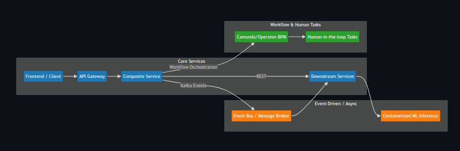

# Distributed Java Platform – Architecture & System Design

This repository documents the **architecture and system design** of a distributed Java-based platform
leveraging REST APIs, Kafka messaging, workflow orchestration, and human-in-the-loop processing.

> Note: The actual implementation is proprietary and intentionally not included, as this project is planned for future commercialization.

---

## My Role

I was responsible for **designing the system architecture**, defining communication patterns, and integrating AI/ML workflows into a scalable, production-ready environment.

---

## Architecture Overview

- **Frontend → Composite Service → Downstream Services**
- Synchronous REST communication + asynchronous Kafka-based messaging
- Workflow orchestration with **Operaton** (Camunda fork) for long-running processes and human-in-the-loop tasks
- Containerized **AI/ML inference pipelines** integrated via Spring AI

---

## Key Design Decisions

- **Kafka** for decoupled, asynchronous processing between services
- **Spring Cloud Stream** for message abstraction and easier integration
- **Camunda / Operaton** for workflow management and human task coordination
- **Docker** for service isolation and portability
- **Kubernetes** for container orchestration and scaling
- **Observability** via Micrometer, Prometheus, Grafana, and Loki
- Spring Security for OAuth2-based authentication and social login via Keycloak, enabling role-based access control (RBAC) across services.
- Frontend design with Typescript, HTML, CSS and JS.

---

## Skills Highlighted

- Microservices architecture and distributed system design
- Event-driven architecture with Kafka
- Workflow orchestration and human-in-the-loop process design
- AI/ML integration in production environments
- Containerization and orchestration (Docker, Kubernetes)
- Monitoring and observability best practices

---

## Architecture Diagram

  

---

> This repository serves as a portfolio of my **system design and architecture expertise**. The proprietary implementation is not shared, but the design demonstrates my ability to build scalable, maintainable, and complex distributed systems.
