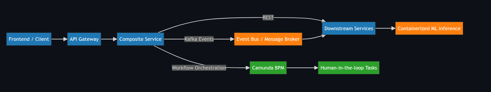

# Distributed Workflow & Messaging Architecture

This repository documents the **architecture and system design** of a distributed Java-based platform
using REST, Kafka messaging, workflow orchestration, and human-in-the-loop processing.

> Note: The implementation is intentionally kept private as this project is planned for future commercialization.

## Architecture Overview

- Frontend → Composite Service → Downstream Services
- Synchronous REST + asynchronous Kafka-based messaging
- Workflow orchestration with Operaton - A Camunda Fork - BPM
- Integration with containerized AI/ML inference

## Key Design Decisions

- Kafka used for decoupling and asynchronous processing
- Spring Cloud Stream for message abstraction
- Camunda for long-running workflows and human tasks
- Docker for isolated, portable services
- Deployment with Kubernetes for all services
- Observation and Micrometer Instrumentation with Grafana, Prometheus and Loki

## Diagrams

# Architecture Diagram

